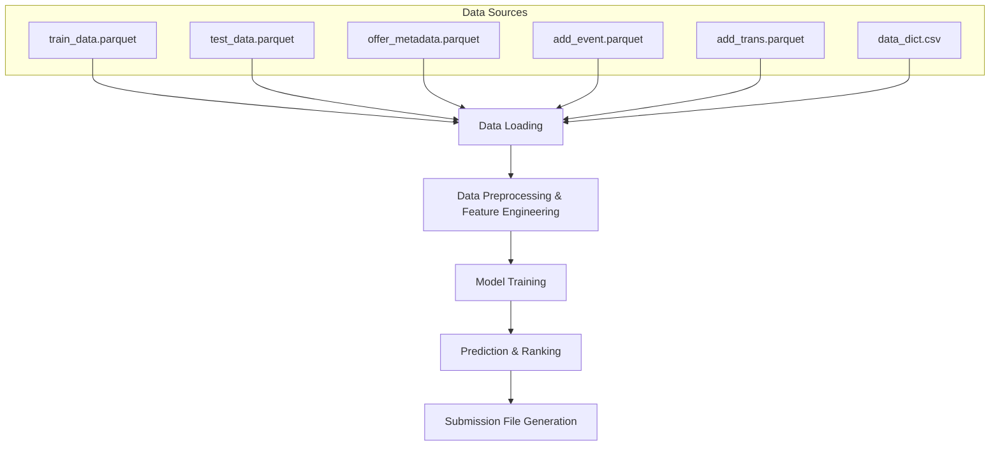

# Round 2 decision science solution guidelines
_Exported on 7/19/2025 at 17:26:52 GMT+5:30 from Cursor (1.2.4)_

---

**User**

Round 2 Guidelines
 ➢ Please use the unscrambled word in uppercase from Round 1 as password for Round 2 which will enable you to participate in Round2
 ➢ Participants can use existing variables, create derived variables from existing ones and use them in their decision science solution
 ➢ Participants must not use identifier variables in their solution
 ➢ Participants are not allowed to add new rows or alter the shared data
 ➢ The created solution must be run on all unique_identifiers
 ➢ Participants need to submit 1 file in Round 2
 ➢ Participants should try to create a decision science solution that is scalable in real world, keeping in mind the evaluation criteria
 ➢ Participants are required to download and follow exact templates of the submission files from Unstop website
 ➢ Max submissions allowed per team in Round 2 are 20,leaderboard would be public basis submission of File and team would be rank ordered basis max 
final score attained
 ➢ Amex will be thoroughly evaluating all solutions to ensure integrity & guarding against any misuse or gaming 

given these instrcutions generate a code or architecure which solves this problem i also have offer_metadata.paraquet, add_event.paraquet, test and train_data.paraquet, add_trans.paraquet, data_dict.csv

---

**Cursor**

Based on the problem statement, guidelines, and the files you have (`offer_metadata.parquet`, `add_event.parquet`, `add_trans.parquet`, `train_data.parquet`, `test_data.parquet`, `data_dict.csv`), here’s a **recommended architecture and code outline** for a scalable, real-world solution to predict the probability of a customer clicking on an offer (i.e., a click-through rate prediction/ranking problem).

---

## 1. **Solution Architecture Overview**



---

## 2. **Key Steps and Code Outline**

### **A. Data Loading**

- Load all `.parquet` and `.csv` files using pandas and pyarrow.

### **B. Data Preprocessing & Feature Engineering**

- **Merge**: Join train/test with offer metadata, events, and transactions using appropriate keys (e.g., customer ID, offer ID).
- **Feature Engineering**:  
  - Aggregate transaction features (e.g., spend in last X days, frequency, recency).
  - Offer features (e.g., type, expiry, popularity).
  - Customer-offer interaction features (e.g., past clicks, impressions).
  - Time-based features (e.g., day of week, hour).
- **Mask/Drop Identifiers**: Remove or mask all identifier columns as per guidelines.

### **C. Model Training**

- Use a **ranking model** (e.g., LightGBM Ranker, XGBoost Ranker, CatBoost, or a classification model with probability output).
- Use cross-validation to avoid overfitting.

### **D. Prediction & Ranking**

- For each user on each day, **predict click probability** for each offer.
- **Rank offers** for each user-day by predicted probability.

### **E. Submission File Generation**

- Format output as per the sample submission (id1, id2, id3, id5, pred).
- Save as CSV with the required naming convention.

---

## 3. **Sample Python Code Outline**

Below is a **template** to get you started. You will need to fill in the feature engineering and model details.

```python
import pandas as pd
import numpy as np
import lightgbm as lgb

# 1. Load Data
train = pd.read_parquet('train_data.parquet')
test = pd.read_parquet('test_data.parquet')
offer_meta = pd.read_parquet('offer_metadata.parquet')
events = pd.read_parquet('add_event.parquet')
trans = pd.read_parquet('add_trans.parquet')
data_dict = pd.read_csv('data_dict.csv')

# 2. Merge Data (example, adjust keys as needed)
train = train.merge(offer_meta, on='id3', how='left')
test = test.merge(offer_meta, on='id3', how='left')
# Add more merges for events, trans, etc.

# 3. Feature Engineering (examples)
# - Aggregate transaction features
# - Encode categorical variables
# - Create time-based features
# - Remove identifier columns

# 4. Prepare Data for Modeling
features = [col for col in train.columns if col not in ['id1', 'id2', 'id3', 'id4', 'id5', 'y']]  # Exclude identifiers
X_train = train[features]
y_train = train['y']
X_test = test[features]

# 5. Model Training (LightGBM example)
model = lgb.LGBMClassifier(objective='binary', n_estimators=1000)
model.fit(X_train, y_train)

# 6. Prediction
test['pred'] = model.predict_proba(X_test)[:, 1]

# 7. Prepare Submission
submission = test[['id1', 'id2', 'id3', 'id5']].copy()
submission['pred'] = test['pred']
submission.to_csv('r2_submission_file<team-name>.csv', index=False)
```

---

## 4. **Best Practices & Tips**

- **Do not use identifier variables** in your model.
- **Do not add or remove rows** from the provided data.
- **Feature engineering** is key: derive meaningful features from transactions, events, and offer metadata.
- **Rank offers** for each user by predicted probability for MAP@7.
- **Validate** your pipeline end-to-end on a sample before full run.
- **Follow the exact submission template**.

---

## 5. **Next Steps**

1. **Implement the code outline above.**
2. **Iteratively improve feature engineering and model selection.**
3. **Test your pipeline and generate a sample submission.**
4. **Check your submission format and naming convention.**
5. **Submit and monitor your leaderboard score.**

---

If you want, I can help you with:
- Detailed feature engineering ideas
- Example code for merging and aggregating data
- Model selection and hyperparameter tuning
- Submission file validation

Let me know which part you want to focus on next!

```plaintext
flowchart TD
    A[Data Loading] --> B[Data Preprocessing & Feature Engineering]
    B --> C[Model Training]
    C --> D[Prediction & Ranking]
    D --> E[Submission File Generation]
    subgraph Data Sources
        F1[train_data.parquet]
        F2[test_data.parquet]
        F3[offer_metadata.parquet]
        F4[add_event.parquet]
        F5[add_trans.parquet]
        F6[data_dict.csv]
    end
    F1 --> A
    F2 --> A
    F3 --> A
    F4 --> A
    F5 --> A
    F6 --> A
```

```python
import pandas as pd
import numpy as np
import lightgbm as lgb

# 1. Load Data
train = pd.read_parquet('train_data.parquet')
test = pd.read_parquet('test_data.parquet')
offer_meta = pd.read_parquet('offer_metadata.parquet')
events = pd.read_parquet('add_event.parquet')
trans = pd.read_parquet('add_trans.parquet')
data_dict = pd.read_csv('data_dict.csv')

# 2. Merge Data (example, adjust keys as needed)
train = train.merge(offer_meta, on='id3', how='left')
test = test.merge(offer_meta, on='id3', how='left')
# Add more merges for events, trans, etc.

# 3. Feature Engineering (examples)
# - Aggregate transaction features
# - Encode categorical variables
# - Create time-based features
# - Remove identifier columns

# 4. Prepare Data for Modeling
features = [col for col in train.columns if col not in ['id1', 'id2', 'id3', 'id4', 'id5', 'y']]  # Exclude identifiers
X_train = train[features]
y_train = train['y']
X_test = test[features]

# 5. Model Training (LightGBM example)
model = lgb.LGBMClassifier(objective='binary', n_estimators=1000)
model.fit(X_train, y_train)

# 6. Prediction
test['pred'] = model.predict_proba(X_test)[:, 1]

# 7. Prepare Submission
submission = test[['id1', 'id2', 'id3', 'id5']].copy()
submission['pred'] = test['pred']
submission.to_csv('r2_submission_file<team-name>.csv', index=False)
```

---

**User**

give a detailed outline and feature engineering for this PS and explain like in easy way

---

**Cursor**

Absolutely! Here’s a **detailed, easy-to-understand outline** for solving this problem, including **feature engineering** ideas and explanations.

---

## 1. **What’s the Problem?**

You need to **predict the probability that a customer will click on an offer** (e.g., a discount or reward) after seeing it, for each day and each offer.  
The goal is to **rank the offers** for each customer so the most likely-to-be-clicked offers are shown at the top.

---

## 2. **What Data Do You Have?**

- **train_data.parquet**: Training data with features and whether the offer was clicked (`y` = 1 or 0).
- **test_data.parquet**: Test data (no `y` column).
- **offer_metadata.parquet**: Info about each offer (type, expiry, etc.).
- **add_event.parquet**: Events like impressions (when an offer was shown) and clicks.
- **add_trans.parquet**: Customer transaction history.
- **data_dict.csv**: Explains what each feature/column means.

---

## 3. **Solution Outline**

### **A. Data Loading**
- Read all files into pandas DataFrames.

### **B. Data Merging**
- Combine (merge) the data so each row has all info about:
  - The customer
  - The offer
  - The customer’s past behavior
  - The offer’s details

### **C. Feature Engineering**
- **Create new features** from the raw data to help the model learn patterns.
- **Remove ID columns** (like customer ID, offer ID) from the features you use for modeling.

### **D. Model Training**
- Use a machine learning model (like LightGBM, XGBoost, CatBoost) to predict the probability of a click.

### **E. Prediction & Ranking**
- For each customer, rank the offers by predicted probability.

### **F. Submission**
- Format your predictions as required and save as a CSV.

---

## 4. **Feature Engineering: What Features to Create?**

### **A. Customer Features**
- **Recency**: Days since last transaction.
- **Frequency**: Number of transactions in the last 7/30 days.
- **Monetary**: Total amount spent in the last 7/30 days.
- **Product Preferences**: Most common product category purchased.
- **Engagement**: Number of times the customer has clicked on any offer in the past.

### **B. Offer Features**
- **Offer Type**: Categorical (e.g., points, cashback, miles).
- **Discount/Reward Amount**: Numeric value of the offer.
- **Expiry**: Days left until the offer expires.
- **Redemption Frequency**: How often this offer has been redeemed by anyone.

### **C. Customer-Offer Interaction Features**
- **Past Interactions**: Has the customer seen/clicked this offer before?
- **Similarity**: Has the customer clicked on similar offers in the past?
- **Time Since Last Seen**: How long since the customer last saw this offer?

### **D. Time Features**
- **Day of Week**: Is it a weekend or weekday?
- **Hour of Day**: What time was the offer shown?

### **E. Channel/Placement Features**
- **Where was the offer shown?** (web, app, email, etc.)

---

## 5. **Easy Example: Feature Engineering in Code**

```python
import pandas as pd

# Example: Calculate recency, frequency, and monetary value for each customer
trans['transaction_date'] = pd.to_datetime(trans['transaction_date'])
latest_date = trans['transaction_date'].max()

# Recency: Days since last transaction
recency = trans.groupby('customer_id')['transaction_date'].max().reset_index()
recency['recency'] = (latest_date - recency['transaction_date']).dt.days

# Frequency: Number of transactions in last 30 days
last_30 = trans[trans['transaction_date'] > latest_date - pd.Timedelta(days=30)]
frequency = last_30.groupby('customer_id').size().reset_index(name='frequency_30d')

# Monetary: Total spent in last 30 days
monetary = last_30.groupby('customer_id')['amount'].sum().reset_index(name='monetary_30d')

# Merge these features into your main train/test data
```

---

## 6. **Why Do These Features Help?**

- **Recency/Frequency/Monetary**: Customers who shop more recently/frequently are more likely to click offers.
- **Offer Type/Value**: Some offers are more attractive than others.
- **Past Interactions**: If a customer clicked similar offers before, they’re more likely to click again.
- **Time Features**: People may be more likely to click offers at certain times/days.

---

## 7. **What to Avoid?**

- **Do NOT use ID columns** (customer ID, offer ID) as features.
- **Do NOT add or remove rows** from the data.
- **Do NOT use any information from the future** (leakage).

---

## 8. **Summary Table: Feature Ideas**

| Feature Name         | What it Means                                 | Why it Helps                |
|----------------------|-----------------------------------------------|-----------------------------|
| recency              | Days since last purchase                      | Recent buyers are engaged   |
| frequency_30d        | Purchases in last 30 days                     | Frequent buyers click more  |
| monetary_30d         | Amount spent in last 30 days                  | Big spenders may click more |
| offer_type           | Type of offer (cashback, points, etc.)        | Some offers are better      |
| offer_expiry_days    | Days until offer expires                      | Urgency can drive clicks    |
| past_offer_clicks    | Has customer clicked this offer before?       | Repeats are likely          |
| similar_offer_clicks | Clicks on similar offers                      | Shows interest in category  |
| day_of_week          | Day offer was shown                           | Behavior varies by day      |
| channel              | Where offer was shown (web/app/email)         | Some channels work better   |

---

## 9. **Next Steps**

1. **Load and merge your data.**
2. **Create the features above (and more if you can think of them).**
3. **Train a model to predict clicks.**
4. **Rank offers for each customer by predicted probability.**
5. **Format your submission as required.**

---

**If you want, I can help you with code for any specific feature or step! Just ask.**

```python
import pandas as pd

# Example: Calculate recency, frequency, and monetary value for each customer
trans['transaction_date'] = pd.to_datetime(trans['transaction_date'])
latest_date = trans['transaction_date'].max()

# Recency: Days since last transaction
recency = trans.groupby('customer_id')['transaction_date'].max().reset_index()
recency['recency'] = (latest_date - recency['transaction_date']).dt.days

# Frequency: Number of transactions in last 30 days
last_30 = trans[trans['transaction_date'] > latest_date - pd.Timedelta(days=30)]
frequency = last_30.groupby('customer_id').size().reset_index(name='frequency_30d')

# Monetary: Total spent in last 30 days
monetary = last_30.groupby('customer_id')['amount'].sum().reset_index(name='monetary_30d')

# Merge these features into your main train/test data
```

---

**User**

i have sent u the traindata and data dictionary, read them and give me code or new architecture

---

**Cursor**

Great! Now that you’ve provided the **data dictionary** and mentioned you have the **train data**, let’s create a **detailed architecture and code outline** tailored to your dataset.

---

## 1. **Understanding Your Data**

### **Key Columns**
- **id1**: Primary Key (do not use as feature)
- **id2**: Customer ID (masked, do not use as feature)
- **id3**: Offer ID (categorical, can be used as feature after encoding)
- **id4**: Event timestamp
- **id5**: Event Date
- **y**: Target variable (1 = clicked, 0 = not clicked)
- **f1–f366**: Engineered features (interest scores, page visits, clicks, impressions, spend, offer details, etc.)

**Most of the heavy feature engineering is already done for you!**  
You have hundreds of features capturing customer behavior, offer details, and interactions.

---

## 2. **Recommended Architecture**

### **A. Data Loading**
- Load `train_data.parquet` and `test_data.parquet` using pandas.
- Load any additional metadata (e.g., `offer_metadata.parquet`) if you want to add more features.

### **B. Data Preprocessing**
- **Drop**: `id1`, `id2`, `id4`, `id5` (do not use as features).
- **Categorical Encoding**: Encode `id3` (Offer ID) and any other categorical features (e.g., `f42`, `f48`, etc.) using Label Encoding or One-Hot Encoding.
- **Missing Values**: Fill or impute missing values (e.g., with mean/median for numerics, mode for categoricals).

### **C. Model Training**
- Use a **tree-based model** (LightGBM, XGBoost, CatBoost) for tabular data.
- Use **cross-validation** to tune hyperparameters and avoid overfitting.

### **D. Prediction & Ranking**
- Predict click probability for each row in the test set.
- For each customer, **rank offers by predicted probability**.

### **E. Submission**
- Format output as per the sample submission: `id1, id2, id3, id5, pred`.

---

## 3. **Sample Code Outline**

Here’s a **ready-to-use code template** for your problem:

```python
import pandas as pd
import numpy as np
import lightgbm as lgb
from sklearn.model_selection import StratifiedKFold
from sklearn.preprocessing import LabelEncoder

# 1. Load Data
train = pd.read_parquet('train_data.parquet')
test = pd.read_parquet('test_data.parquet')

# 2. Drop identifier columns (do not use as features)
drop_cols = ['id1', 'id2', 'id4', 'id5', 'y']  # y is target, keep for train
feature_cols = [col for col in train.columns if col not in drop_cols]

# 3. Encode categorical features (example: id3, f42, f48, etc.)
cat_features = ['id3', 'f42', 'f48', 'f50', 'f52', 'f53', 'f54', 'f55', 'f56', 'f57']  # add more if needed
for col in cat_features:
    le = LabelEncoder()
    all_vals = pd.concat([train[col], test[col]], axis=0).astype(str)
    le.fit(all_vals)
    train[col] = le.transform(train[col].astype(str))
    test[col] = le.transform(test[col].astype(str))

# 4. Handle missing values
train = train.fillna(-999)
test = test.fillna(-999)

# 5. Prepare data for modeling
X = train[feature_cols]
y = train['y']
X_test = test[feature_cols]

# 6. Train LightGBM model with cross-validation
params = {
    'objective': 'binary',
    'metric': 'auc',
    'boosting_type': 'gbdt',
    'learning_rate': 0.05,
    'num_leaves': 31,
    'verbose': -1,
    'n_jobs': -1,
    'seed': 42
}
skf = StratifiedKFold(n_splits=5, shuffle=True, random_state=42)
test_preds = np.zeros(len(test))

for fold, (train_idx, val_idx) in enumerate(skf.split(X, y)):
    print(f"Training fold {fold+1}")
    X_train, X_val = X.iloc[train_idx], X.iloc[val_idx]
    y_train, y_val = y.iloc[train_idx], y.iloc[val_idx]
    lgb_train = lgb.Dataset(X_train, y_train)
    lgb_val = lgb.Dataset(X_val, y_val, reference=lgb_train)
    model = lgb.train(params, lgb_train, valid_sets=[lgb_train, lgb_val], 
                      num_boost_round=1000, early_stopping_rounds=50, verbose_eval=100)
    test_preds += model.predict(X_test, num_iteration=model.best_iteration) / skf.n_splits

# 7. Prepare submission
test['pred'] = test_preds
submission = test[['id1', 'id2', 'id3', 'id5']].copy()
submission['pred'] = test['pred']
submission.to_csv('r2_submission_file<team-name>.csv', index=False)
```

---

## 4. **Feature Engineering Tips (Optional)**

- **Interaction Features**: Try combining features, e.g., `f13` (page categories visited) × `f22` (channels used).
- **Temporal Features**: Extract day of week or hour from `id5` (event date) if not already present.
- **Aggregate Features**: If you have access to transaction or event logs, aggregate stats (mean, sum, count) per customer or offer.

---

## 5. **Summary Table: What You Need to Do**

| Step                | What to Do                                                                 |
|---------------------|----------------------------------------------------------------------------|
| Data Loading        | Read train/test data                                                        |
| Preprocessing       | Drop IDs, encode categoricals, fill missing values                          |
| Modeling            | Train LightGBM/XGBoost/other model                                         |
| Prediction          | Predict click probability for test set                                      |
| Ranking             | For each customer, rank offers by predicted probability                     |
| Submission          | Output as per template: id1, id2, id3, id5, pred                            |

---

**You can copy-paste the code above and adapt it to your needs! If you want to add more features or need help with a specific part, just ask!**

```python
import pandas as pd
import numpy as np
import lightgbm as lgb
from sklearn.model_selection import StratifiedKFold
from sklearn.preprocessing import LabelEncoder

# 1. Load Data
train = pd.read_parquet('train_data.parquet')
test = pd.read_parquet('test_data.parquet')

# 2. Drop identifier columns (do not use as features)
drop_cols = ['id1', 'id2', 'id4', 'id5', 'y']  # y is target, keep for train
feature_cols = [col for col in train.columns if col not in drop_cols]

# 3. Encode categorical features (example: id3, f42, f48, etc.)
cat_features = ['id3', 'f42', 'f48', 'f50', 'f52', 'f53', 'f54', 'f55', 'f56', 'f57']  # add more if needed
for col in cat_features:
    le = LabelEncoder()
    all_vals = pd.concat([train[col], test[col]], axis=0).astype(str)
    le.fit(all_vals)
    train[col] = le.transform(train[col].astype(str))
    test[col] = le.transform(test[col].astype(str))

# 4. Handle missing values
train = train.fillna(-999)
test = test.fillna(-999)

# 5. Prepare data for modeling
X = train[feature_cols]
y = train['y']
X_test = test[feature_cols]

# 6. Train LightGBM model with cross-validation
params = {
    'objective': 'binary',
    'metric': 'auc',
    'boosting_type': 'gbdt',
    'learning_rate': 0.05,
    'num_leaves': 31,
    'verbose': -1,
    'n_jobs': -1,
    'seed': 42
}
skf = StratifiedKFold(n_splits=5, shuffle=True, random_state=42)
test_preds = np.zeros(len(test))

for fold, (train_idx, val_idx) in enumerate(skf.split(X, y)):
    print(f"Training fold {fold+1}")
    X_train, X_val = X.iloc[train_idx], X.iloc[val_idx]
    y_train, y_val = y.iloc[train_idx], y.iloc[val_idx]
    lgb_train = lgb.Dataset(X_train, y_train)
    lgb_val = lgb.Dataset(X_val, y_val, reference=lgb_train)
    model = lgb.train(params, lgb_train, valid_sets=[lgb_train, lgb_val], 
                      num_boost_round=1000, early_stopping_rounds=50, verbose_eval=100)
    test_preds += model.predict(X_test, num_iteration=model.best_iteration) / skf.n_splits

# 7. Prepare submission
test['pred'] = test_preds
submission = test[['id1', 'id2', 'id3', 'id5']].copy()
submission['pred'] = test['pred']
submission.to_csv('r2_submission_file<team-name>.csv', index=False)
```

